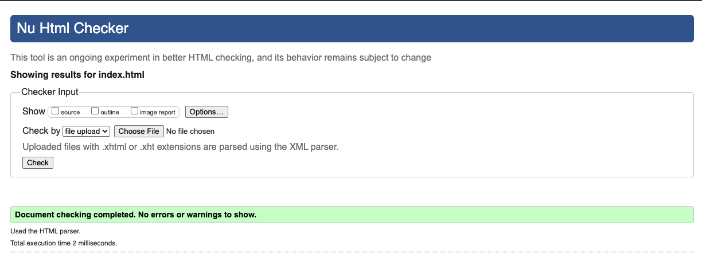
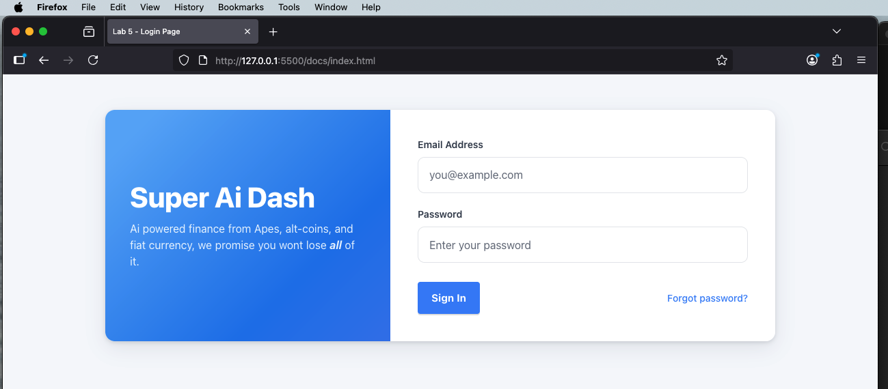
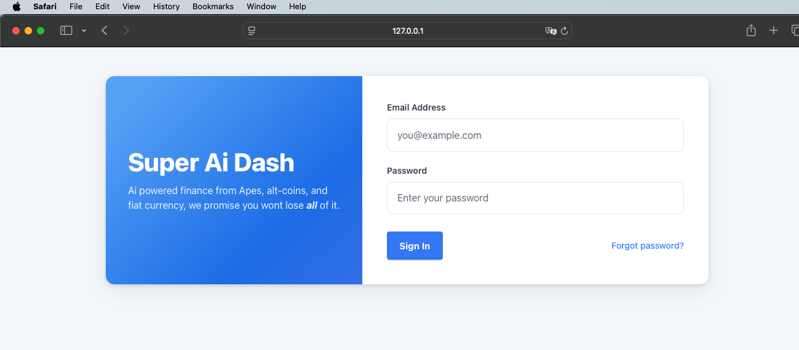

# lab5-css-foundations
Course: COMP 305 Fall 2025

Author: Francis Ortiz

## Overview 

This lab replicates the provided `replication.png` login screen using **semantic HTML**, **CSS Grid/Flexbox**, and **CSS custom properties**.

## Learning Objectives

-Build semantic HTML structure using appropriate elements for a login page

-Learn modern CSS layout techniques with CSS Grid and Flexbox

-Implement CSS custom properties (variables) for maintainable styling

-Apply appropriate CSS units (rem, em, %, vh, vw) for responsive design

-Create interactive states with hover effects and transitions

-Develop attention to detail with polish and refinement

-Practice replicating a design from a reference image

---

##  Implementation Approach
I began by structuring the page semantically with `<main>`, `<aside>`, `<section>`, and `<form>` elements before applying any visual styling.  
Once the HTML validated cleanly, I used **CSS Grid** to create a two-column layout and **Flexbox** to center content inside each section.

I defined **CSS custom properties** in `:root` for colors, spacing, and typography to maintain consistency across elements.  
Interactive effects (hover states, focus outlines, smooth transitions) were implemented using variables and transition timing.

---
## Testing 

Validator verification 

Chrome check 

Firefox Check 

Safari Check 

##  Challenges & Solutions

| Challenge | Solution |
|------------|-----------|
| Getting the grid columns to align perfectly between panels | Defined `grid-template-columns: 1.2fr 1fr;` for proportional sizing |
| Matching the exact gradient from the design reference | Adjusted gradient stops (`10%, 70%, 110%`) and introduced a lighter blue tone |
| Accessibility warning in validator | Added a visually hidden heading inside the form section for screen readers |
| Size mismatch in text and button proportions | Tuned `font-size` and `padding` values for `.brand-subtitle`, `input`, and `.btn` |

## License
This project is licensed under the MIT License - see [LICENSE.md](LICENSE.md)